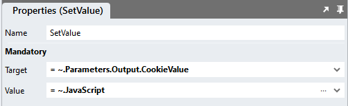

# Cookies

This module provides three small scripts to create, read and delete cookies. Cookies are small strings of data that are stored in the browser and are passed back and forth between web browsers and web servers. Cookies can be created in the browser using Javascript or on the server and can be useful to keep state or store user preferences. 

More on [Cookies](https://en.wikipedia.org/wiki/HTTP_cookie)

## Features
1. Cookies created using this module can only be read by the application they were written in. 
2. Tracking cookies (third-party cookies) cannot be written using this module, only first-party cookies (SameSite=strict). 
3. This module also only supports secure cookies. Secure cookies can only be transmitted over an encrypted connection (Secure=true). 

## Version
1.0 - Initial

## Write Cookie Global Script Setup
1. Create a Global Script and name it "WriteCookie"
2. Add the input parameters below to the script
   1. ExpiryDays
   2. Name
   3. Value
3. Drag a Javascript action into the script and paste the Javascript below unaltered into the action
```javascript
/* Stadium Script v1.0 */
let name = ~.Parameters.Input.Name;
let value = ~.Parameters.Input.Value;
let exdays = ~.Parameters.Input.ExpiryDays || 100;
let pathParts = window.location.pathname.split('/');
let path = "";
if (pathParts.length > 2) {
    path = pathParts[1];
}
let options = {
	path: '/' + encodeURIComponent(path),
	secure: true,
    samesite: "strict",
    domain: window.location.hostname,
};
const d = new Date();
d.setTime(d.getTime() + (exdays*24*60*60*1000));
options.expires = "expires="+ d.toUTCString();
let updatedCookie = encodeURIComponent(name) + "=" + encodeURIComponent(value);
for (let optionKey in options) {
	updatedCookie += "; " + optionKey;
	let optionValue = options[optionKey];
	if (optionValue !== true) {
	  updatedCookie += "=" + optionValue;
	}
}
document.cookie = updatedCookie;
```

## Writing a Cookie
1. Drag the "WriteCookie" global script into another script (e.g. the Page.Load event handler)
2. Complete the input parameters 
   1. ExpiryDays (integer): The number of days until the cookie expires
   2. Name (string): The name of the cookie 
   3. Value (string): The value to store in the cookie (max 4kb)

## Get Cookie Global Script Setup
1. Create a Global Script and name it "GetCookie"
2. Add the input parameters below to the script
   1. Name
3. Add the output parameter below to the script
   1. CookieValue
4. Drag a Javascript action into the script and paste the Javascript below unaltered into the action
```javascript
/* Stadium Script v1.0 */
let name = ~.Parameters.Input.Name;
let matches = document.cookie.match(new RegExp(
"(?:^|; )" + name.replace(/([\.$?*|{}\(\)\[\]\\\/\+^])/g, '\\$1') + "=([^;]*)"
));
return matches ? decodeURIComponent(matches[1]) : undefined;
```
4. Drag a SetValue action into the "GetCookie" script and select the values below from the dropdowns
   1. Target: ~.Parameters.Output.CookieValue
   2. Source: ~.JavaScript



## Reading a Cookie
1. Drag the "GetCookie" global script into another script (e.g. the Page.Load event handler)
2. Complete the input parameters 
   1. Name (string): The name of the cookie to retrieve

## Delete Cookie Global Script Setup
1. Create a Global Script and name it "DeleteCookie"
2. Add the input parameters below to the script
   1. Name
3. Drag a Javascript action into the script and paste the Javascript below unaltered into the action
```javascript
/* Stadium Script v1.0 */
let name = ~.Parameters.Input.Name;
let exdays = -1;
let options = {
	path: '/',
	secure: true,
	samesite: "strict",
};
const d = new Date();
d.setTime(d.getTime() + (exdays*24*60*60*1000));
options.expires = "expires="+ d.toUTCString();
let updatedCookie = encodeURIComponent(name) + "=";
for (let optionKey in options) {
	updatedCookie += "; " + optionKey;
	let optionValue = options[optionKey];
	if (optionValue !== true) {
	  updatedCookie += "=" + optionValue;
	}
}
document.cookie = updatedCookie;
```

## Deleting a Cookie
1. Drag the "DeleteCookie" global script into another script (e.g. the Page.Load event handler)
2. Complete the input parameters 
   1. Name (string): The name of the cookie to remove